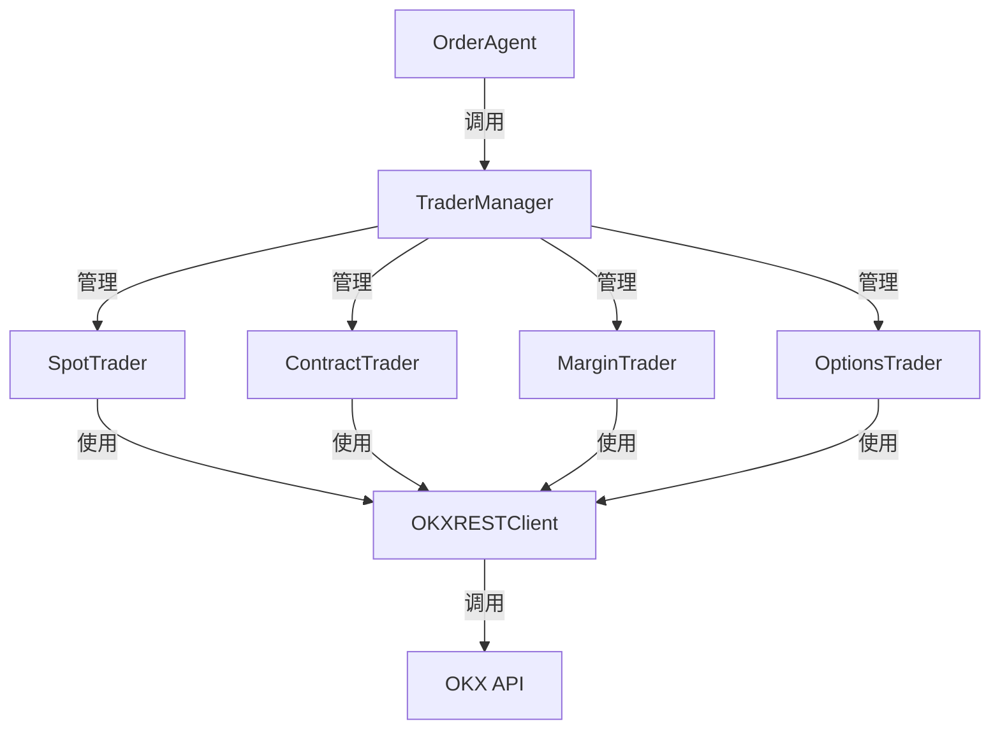
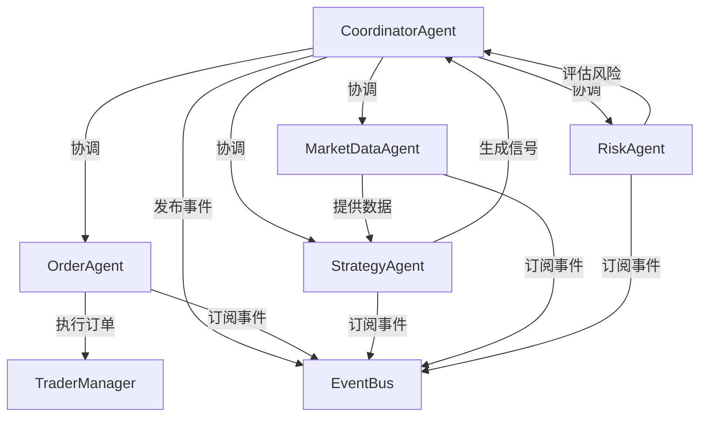
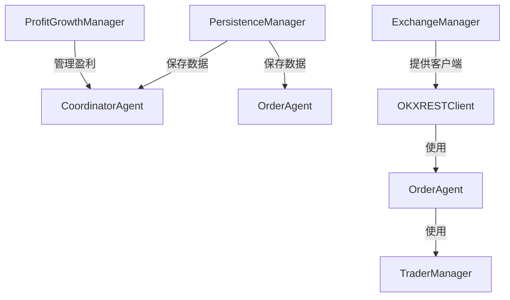
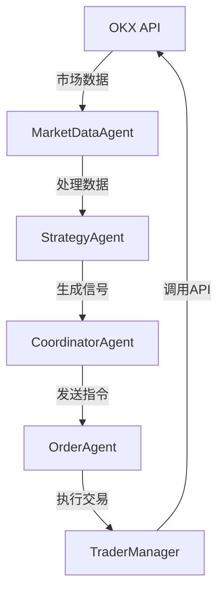
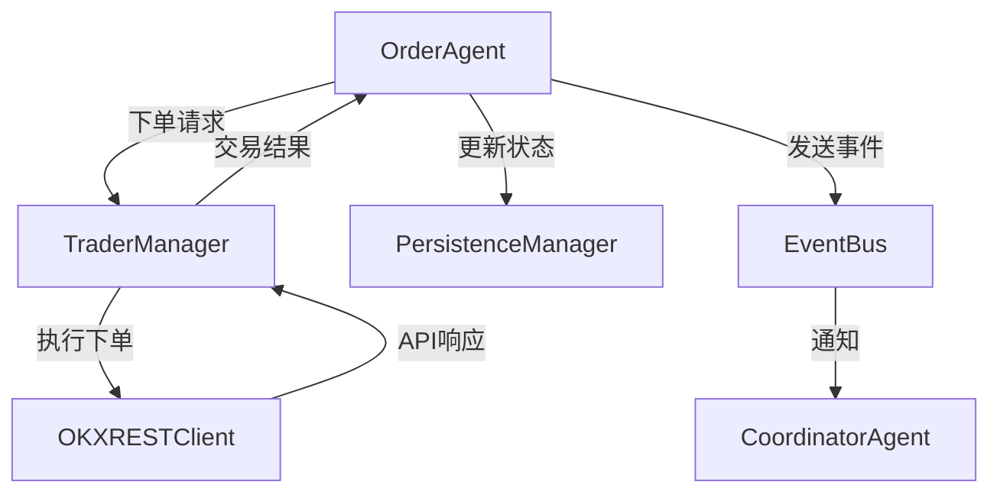

# 交易系统组件关系

## 系统架构概览

交易系统采用分层架构设计，由交易器、智能体和辅助工具组成，各组件之间通过明确的接口进行交互，形成一个完整的交易生态系统。

## 核心组件关系

### 1. 交易器（Trader）

**交易器**是系统的核心执行层，负责直接与交易所API交互，执行具体的交易操作。

#### 交易器层次结构
```
BaseTrader (基类)
├── SpotTrader (现货交易器)
├── MarginTrader (杠杆交易器)
├── ContractTrader (合约交易器)
└── OptionsTrader (期权交易器)
```

#### 交易器管理器
- **TraderManager**：管理所有交易器实例，提供统一的交易接口

### 2. 智能体（Agent）

**智能体**是系统的业务逻辑层，负责实现各种交易策略和管理功能。

#### 智能体层次结构
```
BaseAgent (基类)
├── CoordinatorAgent (协调智能体)
├── OrderAgent (订单智能体)
├── StrategyAgent (策略智能体)
├── MarketDataAgent (市场数据智能体)
├── RiskAgent (风险智能体)
└── AccountSyncAgent (账户同步智能体)
```

### 3. 辅助工具

**辅助工具**是系统的支持层，提供各种通用功能和服务。

#### 辅助工具列表
- **EventBus**：事件总线，用于智能体间通信
- **OKXRESTClient**：OKX API客户端，用于与OKX API通信
- **ExchangeManager**：交易所管理器，管理交易所连接
- **PersistenceManager**：持久化管理器，保存数据到OSS
- **ProfitGrowthManager**：盈利增长管理器，确保盈利增长
- **APIManager**：API管理器，负责管理所有的API调用，实现消息分发功能
- **CycleEventManager**：循环事件管理器，负责主循环事件，实现定时任务和数据校准

## 组件交互关系

### 1. 交易器与智能体的关系



### 2. 智能体之间的关系



### 3. 辅助工具与其他组件的关系



## 详细交互流程

### 1. 下单流程

1. **策略智能体**生成交易信号
2. **协调智能体**接收信号并进行评估
3. **订单智能体**接收协调智能体的下单指令
4. **订单智能体**调用**交易器管理器**的下单方法
5. **交易器管理器**根据交易类型选择合适的交易器
6. **交易器**调用**OKX REST客户端**发送订单
7. **OKX REST客户端**与OKX API交互
8. **交易器**返回交易结果给**订单智能体**
9. **订单智能体**更新订单状态并发送事件
10. **协调智能体**接收事件并更新系统状态

### 2. 订单管理流程

1. **订单智能体**定期查询未成交订单
2. **订单智能体**调用**交易器**的`get_open_orders`方法
3. **交易器**调用**OKX REST客户端**获取未成交订单
4. **订单智能体**处理超时订单，调用**交易器**的`cancel_order`方法
5. **交易器**调用**OKX REST客户端**取消订单
6. **订单智能体**更新订单状态并发送事件

### 3. 账户同步流程

1. **订单智能体**定期同步账户信息
2. **订单智能体**调用**交易器**的`get_account_info`方法
3. **交易器**调用**OKX REST客户端**获取账户余额
4. **订单智能体**更新本地账户信息
5. **订单智能体**发送账户更新事件
6. **协调智能体**接收事件并更新系统状态

## 核心接口关系

### 1. 交易器接口

| 方法 | 功能 | 调用方 | 实现方 |
|------|------|--------|--------|
| `buy` | 买入/做多 | OrderAgent | 各交易器实现 |
| `sell` | 卖出/做空 | OrderAgent | 各交易器实现 |
| `set_take_profit` | 设置止盈单 | OrderAgent | 各交易器实现 |
| `set_stop_loss` | 设置止损单 | OrderAgent | 各交易器实现 |
| `cancel_order` | 撤销订单 | OrderAgent | BaseTrader |
| `get_order` | 获取订单信息 | OrderAgent | BaseTrader |
| `get_open_orders` | 获取未成交订单 | OrderAgent | BaseTrader |
| `get_account_info` | 获取账户信息 | OrderAgent | 各交易器实现 |
| `get_position` | 获取持仓信息 | OrderAgent | 各交易器实现 |

### 2. 智能体接口

| 方法 | 功能 | 调用方 | 实现方 |
|------|------|--------|--------|
| `start` | 启动智能体 | 外部系统 | BaseAgent |
| `stop` | 停止智能体 | 外部系统 | BaseAgent |
| `send_message` | 发送消息 | 其他智能体 | BaseAgent |
| `_execute_cycle` | 执行周期任务 | BaseAgent | 各智能体实现 |
| `_handle_order_command` | 处理订单命令 | EventBus | OrderAgent |
| `_on_order_event` | 处理订单事件 | EventBus | OrderAgent |

### 3. 辅助工具接口

| 方法 | 功能 | 调用方 | 实现方 |
|------|------|--------|--------|
| `place_order` | 下单 | 交易器 | OKXRESTClient |
| `cancel_order` | 撤单 | 交易器 | OKXRESTClient |
| `get_order` | 获取订单 | 交易器 | OKXRESTClient |
| `get_account_balance` | 获取账户余额 | 交易器 | OKXRESTClient |
| `publish_async` | 发布事件 | 智能体 | EventBus |
| `subscribe` | 订阅事件 | 智能体 | EventBus |
| `save_data` | 保存数据 | 智能体 | PersistenceManager |
| `load_data` | 加载数据 | 智能体 | PersistenceManager |

## 系统数据流

### 1. 市场数据流向



### 2. 订单数据流



### 3. 账户数据流

```mermaid
flowchart TD
    A[OKX API] -->|账户数据| B[APIManager]
    B -->|分发消息| C[AccountSyncAgent]
    C -->|更新状态| D[PersistenceManager]
    C -->|发送事件| E[EventBus]
    E -->|通知| F[CoordinatorAgent]
    F -->|更新系统状态| G[ProfitGrowthManager]

### 4. 消息分发数据流

```mermaid
flowchart TD
    A[APIManager] -->|分发消息| B[CoordinatorAgent]
    A -->|分发消息| C[OrderAgent]
    A -->|分发消息| D[AccountSyncAgent]
    A -->|分发消息| E[StrategyAgent]
    B -->|注册处理器| A
    C -->|注册处理器| A
    D -->|注册处理器| A
    E -->|注册处理器| A

### 5. 定时任务数据流

```mermaid
flowchart TD
    A[CycleEventManager] -->|执行任务| B[CoordinatorAgent]
    A -->|执行任务| C[OrderAgent]
    A -->|执行任务| D[AccountSyncAgent]
    B -->|添加任务| A
    C -->|添加任务| A
    D -->|添加任务| A
```

## 总结

交易系统通过清晰的分层架构和组件化设计，实现了高度的模块化和可扩展性。各组件之间通过明确的接口进行交互，形成了一个完整的交易生态系统。

- **交易器**负责直接与交易所API交互，执行具体的交易操作
- **智能体**负责实现业务逻辑，如交易策略、订单管理、风险控制等
- **辅助工具**提供通用功能，如事件通信、数据持久化、API调用等

这种设计使得系统易于维护和扩展，可以根据需要添加新的交易器类型、智能体或辅助工具，以适应不同的交易需求和场景。